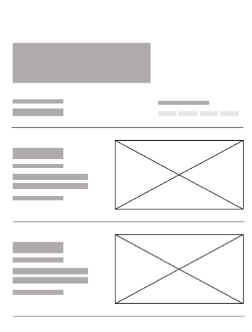
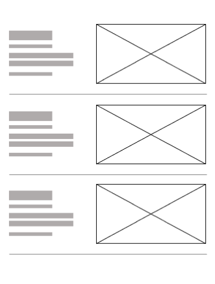
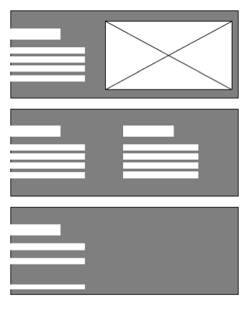
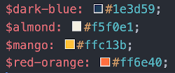

### Portfolio

With web technologies acquired thus far, my personal portfolio page will be continuously revised.

### Requirement

This portfolio is set to evolve around my core skills, goals, values and passion. With a minimalistic style as my preferred choice, it should be simple and highly navigatable. To be UI friendly, the portfolio is equipped with components like a site preloader.

### Wireframe

- Section 1 
  
- Section 2 
  
- Section 3 
  

### Color palette

